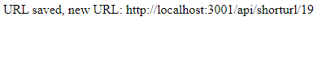

# URL Shortener Microservice
This is a NodeJS only project.

Upon entry a html page is rendered with the following:

Once entering a valid url, a new url is created and displayed for the user(Based on the current path the project is being hosted on).

If everything went through as expected without any errors, the new url will automatically redirect to the old inserted link, which could shorten the inserted URL completely, if the base URL is short on its own.
